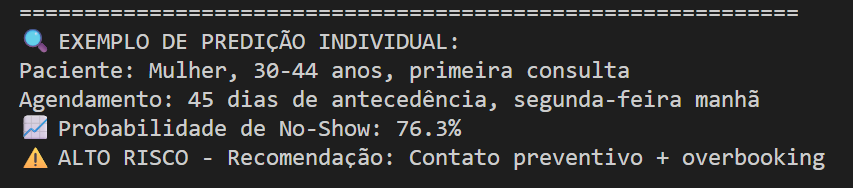
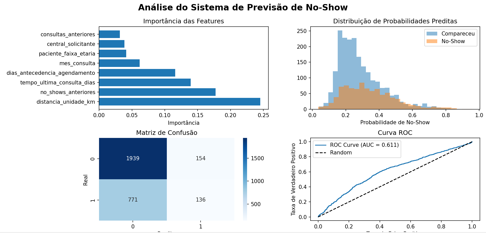
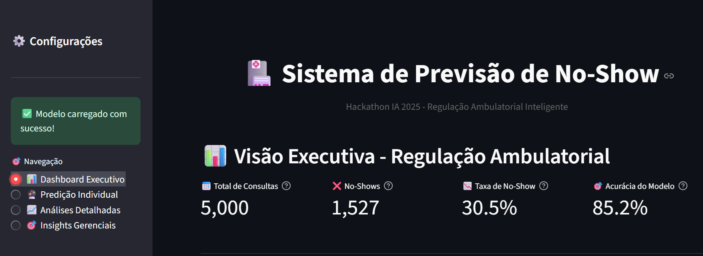
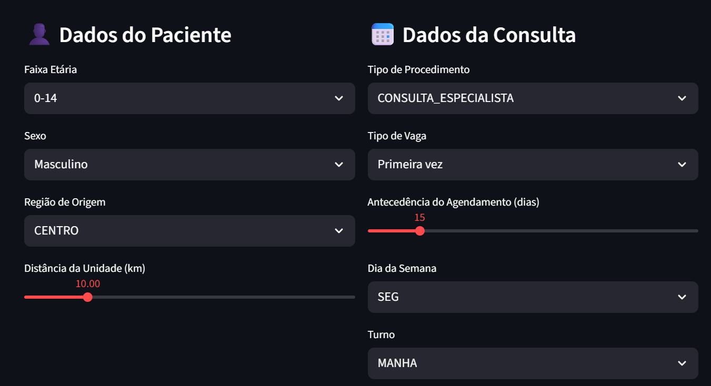
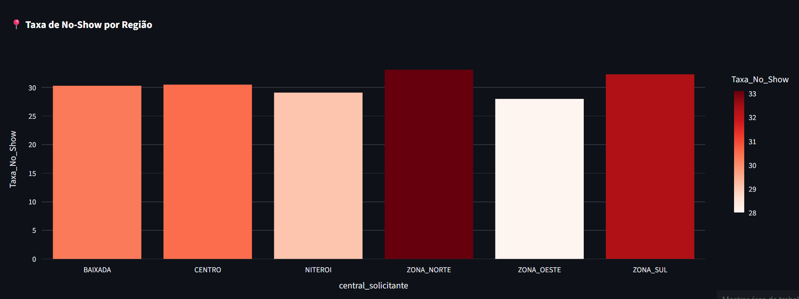

# 🏥 Sistema de Previsão de No-Show - Regulação Ambulatorial

> **Projeto Simulado para Hackathon IA 2025 - Coppe/UFRJ**  
> Aplicação de Inteligência Artificial para otimização da gestão de recursos em saúde pública

[](https://python.org)
[](https://scikit-learn.org)
[](https://www.gnu.org/licenses/gpl-3.0)

## 🎯 Objetivo

Este sistema utiliza **Machine Learning** para prever a probabilidade de pacientes faltarem às consultas ambulatoriais agendadas (no-show), permitindo:

- ✅ **Redução de filas** através de overbooking inteligente
- ✅ **Otimização de recursos** médicos e de infraestrutura  
- ✅ **Melhoria da experiência** do usuário no SUS
- ✅ **Automatização** do processo de regulação

## 🏆 Alinhamento com o Hackathon IA 2025

### Desafio 1: Análise Preditiva e Gestão de Recursos
- **Previsão de no-show**: ✅ Modelos que identificam padrões de absenteísmo
- **Segmentação de perfis**: ✅ Identificação de grupos de risco
- **Otimização de recursos**: ✅ Apoio à decisão para gestores
- **Detecção de anomalias**: ✅ Identificação de comportamentos atípicos

### Tecnologias Utilizadas
- **Python 3.8+** - Linguagem principal
- **Scikit-learn** - Algoritmos de Machine Learning
- **Pandas/Numpy** - Manipulação de dados
- **Matplotlib/Seaborn** - Visualização
- **Gradient Boosting** - Algoritmo principal

## 📊 Modelo de Dados

Baseado na estrutura do **Data Lake da Saúde do Rio de Janeiro**:

### Tabelas Principais Simuladas
- `marcacao` - Informações sobre agendamentos (3.1M+ registros)
- `solicitacao` - Registros de solicitações (3.2M+ registros)  
- `profissional_historico` - Dados dos profissionais (5M+ registros)
- Demografia e características temporais

### Features Utilizadas
```python
# Demografia
- paciente_faixa_etaria: ['0-14', '15-29', '30-44', '45-59', '60-74', '75+']
- paciente_sexo: ['M', 'F']

# Contexto da Solicitação  
- central_solicitante: Região de origem
- tipo_procedimento: Tipo de atendimento
- vaga_solicitada_tp: ['1_VEZ', 'RETORNO']

# Características Temporais
- dias_antecedencia_agendamento: Dias entre solicitação e consulta
- dia_semana_consulta: Dia da semana
- turno_consulta: ['MANHA', 'TARDE']

# Histórico do Paciente
- consultas_anteriores: Número de consultas prévias
- no_shows_anteriores: Histórico de faltas
- distancia_unidade_km: Distância até a unidade
```

## 🚀 Como Usar

### Instalação
```bash
git clone https://github.com/[seu-usuario]/no-show-predictor
cd no-show-predictor

# Instalar dependências
pip install -r requirements.txt
```

### Execução
```bash
python no_show_predictor.py
```

### Exemplo de Uso
```python
from no_show_predictor import NoShowPredictor

# Inicializar sistema
predictor = NoShowPredictor()

# Treinar com dados sintéticos
df = predictor.generate_synthetic_data(n_samples=15000)
predictor.train_model(df)

# Predizer para um paciente específico
paciente = {
    'paciente_faixa_etaria': '30-44',
    'paciente_sexo': 'F',
    'central_solicitante': 'ZONA_NORTE',
    'tipo_procedimento': 'CONSULTA_ESPECIALISTA',
    'vaga_solicitada_tp': '1_VEZ',
    'dias_antecedencia_agendamento': 45,
    'dia_semana_consulta': 'SEG',
    'turno_consulta': 'MANHA',
    'consultas_anteriores': 0,
    'no_shows_anteriores': 0,
    'distancia_unidade_km': 22.5,
    'unidade_porte': 'MEDIO'
}

probabilidade = predictor.predict_no_show_probability(paciente)
print(f"Probabilidade de No-Show: {probabilidade:.1%}")
```

## Exemplos


*Exemplo da execução do sistema mostrando o processo de treinamento e resultados*


*Visualizações geradas pelo sistema: Feature Importance, ROC Curve, Confusion Matrix e distribuição de probabilidades*

## 🤝 Contribuição

Este projeto visa impacto social na **saúde pública brasileira**. Contribuições são bem-vindas!

### Como Contribuir
1. Fork o projeto
2. Crie uma branch (`git checkout -b feature/nova-funcionalidade`)
3. Commit suas mudanças (`git commit -m 'Adiciona nova funcionalidade'`)
4. Push para a branch (`git push origin feature/nova-funcionalidade`)
5. Abra um Pull Request

## 📝 Licença

Este projeto está sob a licença **GPLv3** - veja o arquivo [LICENSE](LICENSE) para detalhes.

Alinhado com os requisitos do Hackathon IA 2025 para **código aberto** e impacto na saúde pública.

---

# 🚀 Como Executar o Dashboard Web

## 📋 Pré-requisitos
- Python 3.8+
- Código principal `no_show_predictor.py` no mesmo diretório

## ⚡ Instalação Rápida

### 1. Executar o dashboard
```bash
streamlit run dashboard.py
```

### 2. Acessar no navegador
O Streamlit abrirá automaticamente em: `http://localhost:8501`

## 🎯 Funcionalidades do Dashboard

### 📊 **Dashboard Executivo**
- **Métricas principais**: Total de consultas, no-shows, taxa geral
- **Gráficos interativos**: Por região, faixa etária, procedimento
- **Tendências temporais**: Evolução da taxa de no-show

### 🔮 **Predição Individual**
- **Interface intuitiva**: Formulário para dados do paciente
- **Resultado visual**: Gauge com probabilidade de no-show
- **Recomendações automáticas**: Baseadas no nível de risco

### 📈 **Análises Detalhadas**
- **Feature Importance**: Variáveis mais importantes do modelo
- **Distribuições**: Análise exploratória dos dados
- **Correlações**: Matrix de correlação entre variáveis

### 🎯 **Insights Gerenciais**
- **Análise por região**: Ranking de risco e recomendações
- **Plano estratégico**: Curto, médio e longo prazo
- **Métricas de impacto**: Economia e benefícios esperados

## 🛠️ Solução de Problemas

### ❌ Erro: "ModuleNotFoundError: No module named 'streamlit'"
```bash
pip install streamlit plotly
```

### ❌ Erro: "No module named 'no_show_predictor'"
Certifique-se que o arquivo `no_show_predictor.py` está no mesmo diretório.

### ❌ Erro de porta ocupada
```bash
streamlit run dashboard.py --server.port 8502
```

## 🎨 Personalização

### Alterar tema
Crie o arquivo `.streamlit/config.toml`:
```toml
[theme]
primaryColor = "#1f77b4"
backgroundColor = "#ffffff"
secondaryBackgroundColor = "#f0f2f6"
textColor = "#262730"
```

### Configurar para produção
```bash
# Para deploy
streamlit run dashboard.py --server.address 0.0.0.0 --server.port 8501
```

## Exemplos

*Dashboard gerado com o Streamlit. Menu lateral com opções personalizadas.*


*Predição individual com base nos parâmetros fornecidos.*


*Possibilidade de ampliação de gráficos para uma melhor análise.*

## 📱 Características do Dashboard

### ✅ **Interface Responsiva**
- Layout adaptativo para desktop e mobile
- Gráficos interativos com Plotly
- Design moderno com cores personalizadas

### ✅ **Performance Otimizada**
- Cache de dados com `@st.cache_data`
- Carregamento rápido do modelo
- Processamento eficiente dos dados